    \ \  //  
     \ \//  
      \ \ 
     //\ \
    //  \ \
     yapper

X-Yapper is a CLI tool that allows you to send tweets to your x.com (Twitter) profile. 

## Authentication

[OAuth 2.0 Authorization Code Flow with PKCE](https://developer.x.com/en/docs/authentication/oauth-2-0/authorization-code) is used to authenticate your X profile. The **Prior to Starting** section guides you through setting up the necessary tokens required to communicate through the [X API](https://developer.x.com/en/docs/x-api/getting-started/about-x-api).

## Prior to Starting

### X Developer App

To use x-yapper, you need an X Developer account (free). The steps below will guide you through the setup if you don't already have one. 

1. Visit https://developer.x.com/ and sign-in using your X credentials.
2. Go through the initial setup steps to configure a new app through the developer portal. 
3. After you complete the initial configuration (naming app, description, icon, etc.), click on the app through the Dashboard and scroll down to the  **User authentication set up** section and click **Edit**.
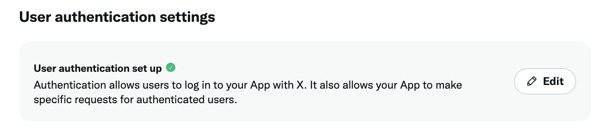
4. Set the following configurations: 
    - **App Permissions**: Read and Write
    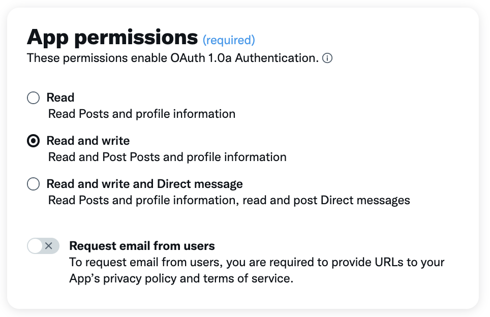
    - **Type of app**: Native App
    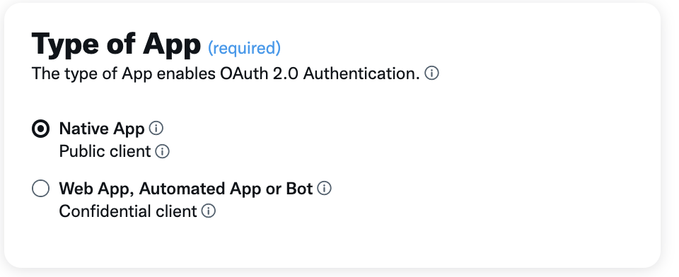
    - **App info**:
        - **Callback URL**: `http://localhost:8080/callback`
        - **Website URL**: `http://www.localhost`
    - The remaining configurations are optional.
    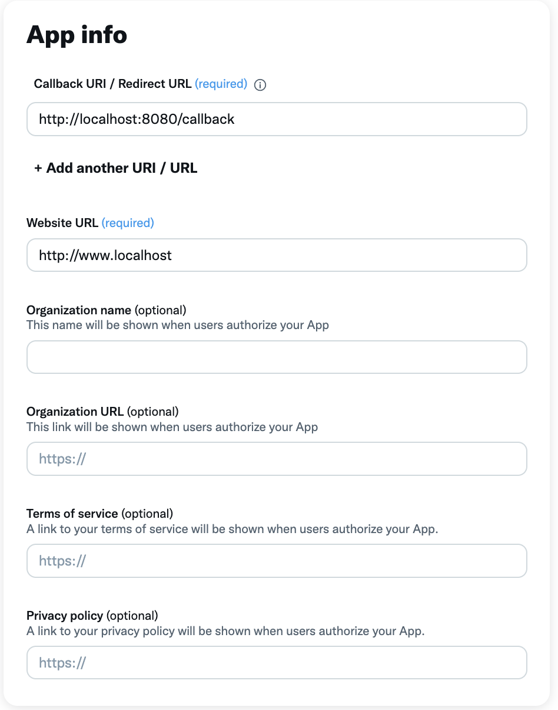
    - Click **Save**.
5. At the top of the app page, click the **Keys and Tokens** tab.
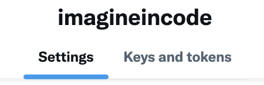
6. Create an **OAuth 2.0 Client ID and Client Secret**. Save these to a password manager as you will need to reference them later. 

### Local Environment Variables

X-Yapper assumes you have the Client ID and Client Secret set as local environment variables. Follow the steps below based on your operating system:

> note: additional support for storing and/or referencing the Client ID and Client Secret will likely be added in a future release. This method was chosen for its ease of use and the nature of how the tokens are used. 

#### Temporary (current session only)

**Linux and macOS (Bash/Zsh)**

```bash
export TWITTER_CLIENT_ID="<client_id>"
export TWITTER_CLIENT_SECRET="<client_secret>"
```
- **To verify:**
```bash
echo $TWITTER_CLIENT_ID
echo $TWITTER_CLIENT_SECRET
```

**Windows**

**CMD**
```cmd
set TWITTER_CLIENT_ID=<client_id>
set TWITTER_CLIENT_SECRET=<client_secret>
```
- **To verify:**
```
echo %TWITTER_CLIENT_ID%
echo %TWITTER_CLIENT_SECRET%
```
**PowerShell**
```powershell
$env:TWITTER_CLIENT_ID="<client_id>"
$env:TWITTER_CLIENT_SECRET="<client_secret>"
```
- **To verify:**
```powershell
$env:TWITTER_CLIENT_ID
$env:TWITTER_CLIENT_SECRET
```
## Running X-Yapper

### Building from source

#### Prerequisites

1. Go 1.23 or higher
2. Git installed

#### Steps

**Linux and macOS**

1. Open a terminal window and clone the repo: 
```bash
git clone https://github.com/imagineincode/x-dev.git
```
2. Navigate to the repo directory:
```bash
cd x-dev
```
3. Build the application: 
```bash
go build -o x-yapper ./cmd/x-yapper
```
4. Run x-yapper:
```bash
./x-yapper
```

**Windows**

1. Open a terminal window and clone the repo: 
```cmd
git clone https://github.com/imagineincode/x-dev.git
```
2. Navigate to the repo directory:
```cmd
cd x-dev
```
3. Build the application: 
```cmd
go build -o x-yapper.exe ./cmd/x-yapper
```
4. Run x-yapper:
```cmd
.\x-yapper.exe
```

## Using X-Yapper

1. You'll be prompted to open an authentication link to enter you X account credentials.
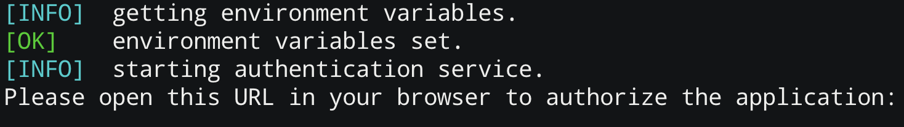
2. Click the link (cmd + click), or copy/paste the link in your browser. 
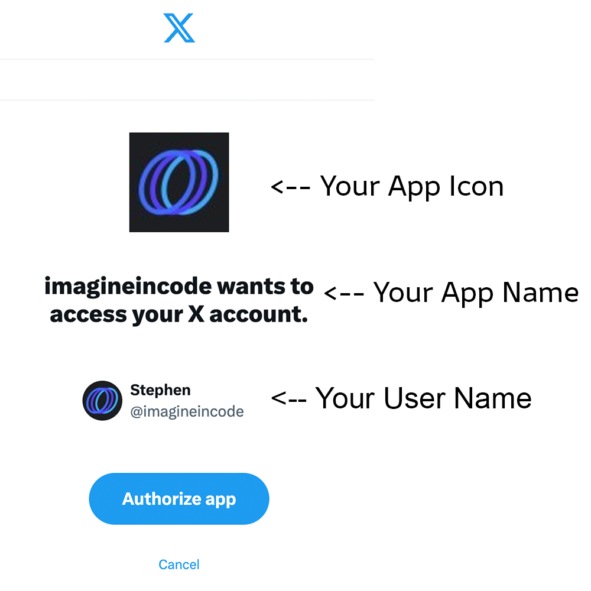
3. Click **Authorize App**.
4. You should see the following message in the browser and can close the window:
    ```
    Authorization successful! You can close this window.
    ```
5. Select **Start New Post**.
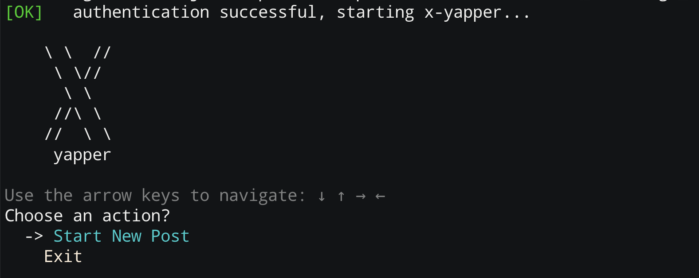
6. Your local text edit is opened within the terminal, allowing you to type your content. Save the file when done.
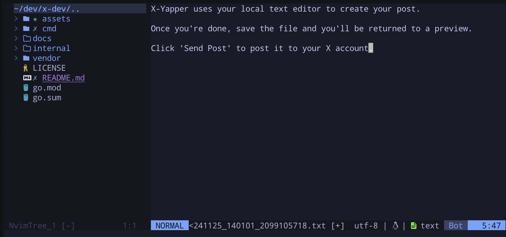
7. You'll be shown a preview of the post, with options to **Send Post** or **Discard**.
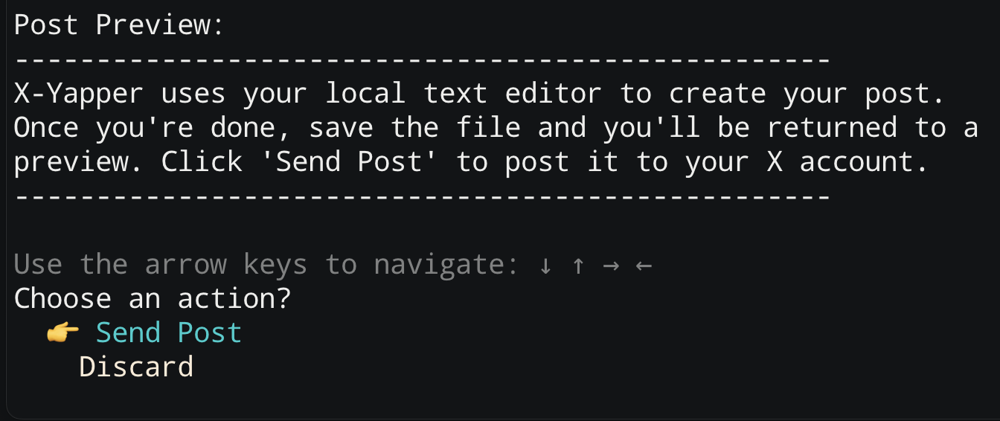
8. After clicking Send Post, you'll receive a confirmation message that the post was successful.
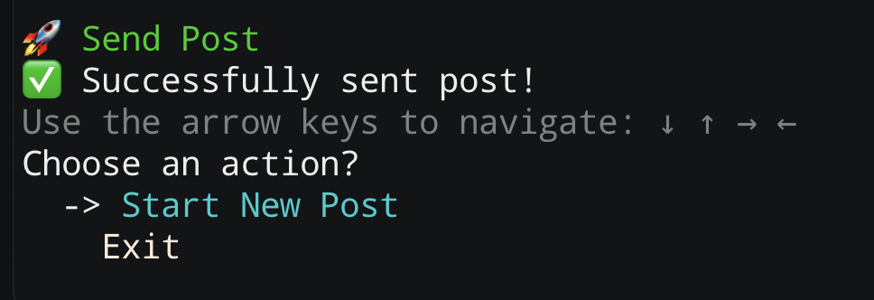
9. At this point, you can choose to send a new post or exit the app.
